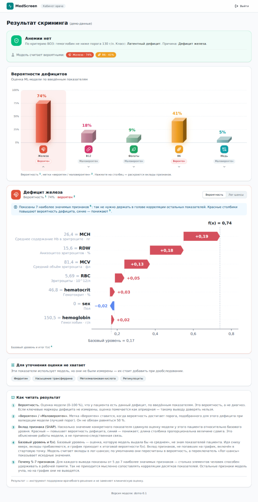
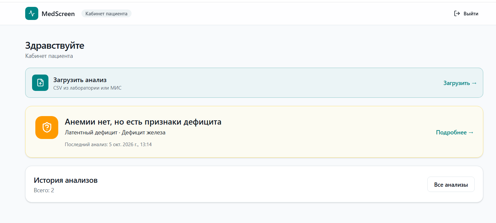

# MedScreen — ИИ-скрининг латентных дефицитных состояний

Прототип веб-сервиса на базе машинного обучения для автоматизированной
интерпретации числовых матриц лабораторных анализов. Сервис выполняет
двухуровневую классификацию:

1. **Уровень 1 — анемия** по полоспецифическим пороговым критериям ВОЗ
   (Hb < 120 г/л у женщин, < 130 г/л у мужчин, < 110 г/л при беременности).
2. **Уровень 2 — дифференциальная диагностика дефицитов** (железо, B12,
   фолаты, B6, медь, воспаление, смешанные формы) с помощью обученных
   CatBoost-моделей и локальных SHAP-объяснений.

Результат — инструмент поддержки врачебного решения. Он не заменяет
клиническую оценку.

## Скриншоты

| Результат скрининга (врач) | Кабинет пациента |
|---|---|
|  |  |

_Скриншоты положите в `docs/screenshots/` рядом с README._

## Архитектура

```
       Frontend (React + Vite)
              │
              ▼
       ┌──────────────┐  X-API-Key  ┌────────┐  X-API-Key  ┌──────────┐
       │ intake :8000 ├────────────►│ deid   ├────────────►│ analysis │
       │  + worker    │             │ :8001  │             │  :8002   │
       └──────┬───────┘             └───┬────┘             └────┬─────┘
              │                         │                       │
              ▼                         ▼                       ▼
        intake-db                 vault-db              CatBoost-модели
   (пациенты, анализы,       (token ↔ patient_id)       (5 × .joblib)
     WORM-аудит)
```

Три изолированных контура:

- **intake** — приём, авторизация, ABAC (врач↔пациент), аудит, оркестрация.
- **deid** — обезличивание (Fernet), top-coding возраста, Vault.
- **analysis** — ML и правиловая логика, не имеет доступа к идентификаторам.

Ключевые принципы:

- **Минимизация данных.** `IdentifiedCase` не содержит ФИО.
- **Изоляция.** Контур анализа не импортирует `deid.*` и не знает ключей
  шифрования.
- **Fail-closed аудит.** Каждое обращение к данным пишется в WORM-журнал
  с HMAC-цепочкой; ошибка записи → ошибка запроса.
- **ABAC + IDOR-защита.** Врач видит только своих пациентов, пациент —
  только свои анализы.

## Стек

**Backend / ML**

- Python 3.12, FastAPI, Pydantic v2, SQLAlchemy 2, Alembic-ready
- PostgreSQL 16
- CatBoost, scikit-learn, numpy, pandas, joblib
- cryptography (Fernet, HKDF), PyJWT
- Docker, Docker Compose

**Frontend**

- React 18, TypeScript, Vite
- TailwindCSS, shadcn/ui
- TanStack Query, Zustand
- Framer Motion (`motion`)
- Recharts + собственный SVG-waterfall для SHAP

## Быстрый старт

### Требования

- Docker Desktop (WSL 2 на Windows)
- Node.js 20+ (для фронтенда)
- 4 ГБ свободной памяти

### 1. Настроить `.env` файлы

```bash
# Корень проекта
cp .env.example .env
# Заполнить: VAULT_ENC_KEY, SERVICE_API_KEY, ANALYSIS_API_KEY, JWT_SECRET

# Intake
cp intake/.env.example intake/.env
# Заполнить: DATA_MASTER_KEY, DEID_API_KEY, JWT_SECRET, DEV_AUTH, CORS_ORIGINS

# Analysis
cp analysis/.env.example analysis/.env
# Заполнить: ANALYSIS_API_KEY, MODEL_BACKEND=ml
```

**Генерация секретов:**

```bash
# Fernet-ключ для Vault
python -c "from cryptography.fernet import Fernet; print(Fernet.generate_key().decode())"

# API-ключи и JWT
python -c "import secrets; print(secrets.token_urlsafe(48))"
```

### 2. Поднять бэкенд

```bash
docker compose up --build -d
docker compose ps
```

Ожидаемо: 6 контейнеров `Up`, обе БД `healthy`.

### 3. Залить демо-пользователей (только для dev)

```bash
# Windows PowerShell
cmd /c "docker compose exec -T intake-db psql -U intake_user -d medscreen_intake < db\seed_demo.sql"

# Linux / macOS
docker compose exec -T intake-db psql -U intake_user -d medscreen_intake < db/seed_demo.sql
```

### 4. Поднять фронтенд

```bash
cd frontend
npm install
npm run dev
```

Откройте http://localhost:5173.

### 5. Демо-вход

На странице логина выберите роль — **Врач** или **Пациент**. Пароль не
требуется (демо-режим, `DEMO_LOGIN_ENABLED=true`).

## API

Основные эндпоинты (все под `X-API-Key` для межсервисного взаимодействия
или `Authorization: Bearer <jwt>` для клиентов):

| Метод | Путь | Назначение |
|---|---|---|
| POST | `/api/v1/auth/demo-login` | Получить JWT для seed-пользователя (демо) |
| GET | `/api/v1/patients` | Реестр пациентов врача |
| POST | `/api/v1/patients` | Регистрация пациента |
| GET | `/api/v1/patients/{id}` | Профиль пациента |
| POST | `/api/v1/patients/{id}/analyses` | Создать анализ от имени врача |
| GET | `/api/v1/patients/{id}/analyses/{aid}` | Результат анализа |
| GET | `/api/v1/me` | Свой профиль (пациент) |
| POST | `/api/v1/me/analyses` | Загрузить свой анализ (пациент) |
| GET | `/health` | Проверка живости |

## ML-модель

`analysis/backends/ml.py` подключает пять CatBoost-моделей (по одной на
каждый дефицит), обученных на 11 признаках общего анализа крови:

```
age_years, sex, hemoglobin, RBC, hematocrit,
MCV, MCH, MCHC, platelets, WBC, RDW
```

SHAP-значения вычисляются локально (permutation SHAP, 10 перестановок) и
выражаются в **долях вероятности**. Это позволяет строить waterfall-график,
где `base + Σ contributions = f(x) = probability`, и фронт отображает
разложение корректно без пересчёта.

Правиловая заглушка (`analysis/backends/rules.py`) сохранена как
fallback и как эталон для сравнения. Переключатель — `MODEL_BACKEND` в
`analysis/.env` (`ml` или `rules`).

> **Внимание.** Модели обучены на синтетическом датасете 840 пациентов.
> Для клинического применения требуется обучение на валидированном наборе
> и внешняя валидация.

## Безопасность и приватность

- **PII шифруется** (Fernet, HKDF-SHA256 из единого мастер-ключа) до
  попадания в основную БД.
- **Слепой индекс ОМС** — HMAC-SHA256 для поиска и запрета дублей без
  расшифровки.
- **Vault** хранит только соответствие `case_token ↔ encrypted patient_id`
  в изолированной БД, недоступной контуру анализа.
- **WORM-аудит** — цепочка HMAC-SHA256, триггеры запрещают
  `UPDATE/DELETE/TRUNCATE`, ключ только у приложения.
- **Top-coding возраста** — значения ≥ 90 приводятся к 90.
- **Общее замечание.** Это прототип. В продакшене требуется mTLS между
  сервисами, сертифицированное СКЗИ (ГОСТ) вместо Fernet, внешний якорь
  аудита (Object Lock / SIEM), ротация ключей.

## Структура проекта

```
.
├── analysis/                # Контур ИИ-скрининга
│   ├── ai.py                # Production inference (CatBoost + SHAP)
│   ├── anemia.py            # Правило ВОЗ (уровень 1)
│   ├── classification.py    # Сведение флагов в (класс, причина)
│   ├── explain.py           # Формирование 5–7 key_features
│   ├── service.py           # Оркестратор двух уровней
│   ├── backends/
│   │   ├── base.py          # Protocol ModelBackend
│   │   ├── ml.py            # ML-адаптер (CatBoost)
│   │   └── rules.py         # Правиловая заглушка
│   └── models/              # 5 × .joblib
├── common/                  # Общие контракты и утилиты
│   ├── labs.py              # Реестр 35 показателей
│   ├── labs_model.py        # Pydantic-модель Labs (автоген)
│   └── schemas.py           # Identified/Deidentified/AnalysisResult
├── db/                      # SQL-схемы
├── deid/                    # Контур обезличивания
│   ├── security.py          # Fernet, case_token
│   ├── service.py           # Deidentifier
│   ├── vault.py             # Хранилище token ↔ patient_id
│   └── main.py              # /v1/process
├── intake/                  # Контур приёма
│   ├── auth.py              # JWT + demo-login
│   ├── audit.py             # WORM-журнал
│   ├── crypto.py            # HKDF, PiiCipher, blind index
│   ├── repository.py        # SQLAlchemy
│   ├── service.py           # Бизнес-логика, ABAC
│   ├── worker.py            # Асинхронная очередь
│   └── main.py              # REST API
├── scripts/                 # Вспомогательные скрипты
├── tests/                   # Тесты
├── frontend/                # React-приложение
├── docker-compose.yml
└── requirements.txt
```

## Тесты

```bash
# Backend
pytest
```

Покрытие: тесты изоляции контура анализа, маскирования данных, сквозной
E2E (загрузка → обезличивание → анализ).

## Ограничения прототипа

- ML-модели обучены на синтетическом датасете, требуют внешней валидации.
- Демо-логин без пароля (`DEMO_LOGIN_ENABLED=true`) — только для показа.
- Нет refresh-токенов, 2FA, rate-limiting.
- HTTPS не настроен (разработка через localhost).
- Реальная интеграция с МИС не реализована.

## Лицензия

MIT. См. [LICENSE](LICENSE).

---

**Автор:** <Команда УРАГАН> · <newheadline@yandex.ru>